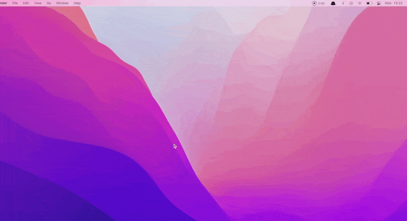
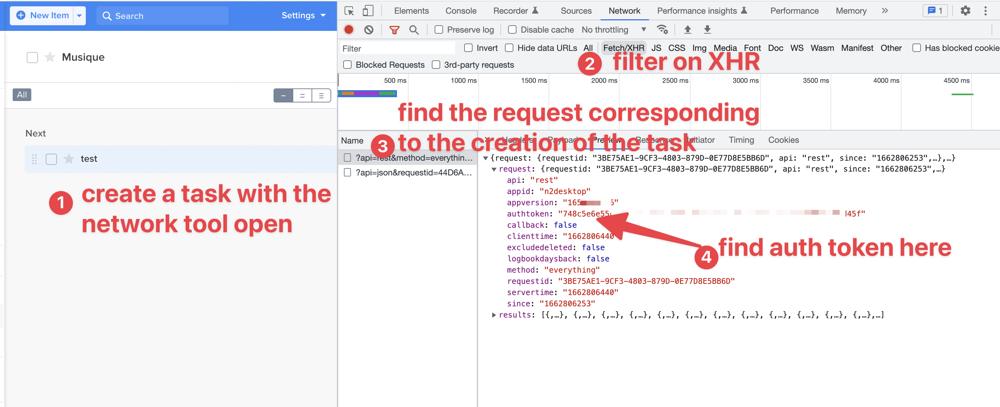

# alfred-nirvanahq

Keep focus : Add tasks to your nirvanahq todo list from Alfred. 

⚡ Fast. 
✨ Frictionless. 
🧘 Distraction free. ️

# Why ? 

I use the [Getting Things Done, aka GTD](https://en.wikipedia.org/wiki/Getting_Things_Done) system. 
I want to be able to add a new task very fastly and without context switching.

# Usage

In Alfred:

- type "at" (as in "add task") to call the workflow. 
- then add the title of your task
- optionally, add "-- [your task notes]" to a note to your tasks.

# Installation 

- Download the latest workflow file (ends with `.alfredworkflow`) from https://github.com/edelans/alfred-nirvanahq/releases 
- install by double-clicking it

# Configuration

- create an account on https://www.nirvanahq.com/
- find the auth_token by examining the request sent by the web app to nirvanahq servers when you add a task : 

# Warning

NirvanaHQ does not provide any API. I just reverse-engineered the request. So this can break anytime (but I've been using it since 2020 !)

# Compatibility

Built on Monterey and Alfred 5 (it's a python3 script).

# Feature ideas ? 

- add support for #projects 
- add support for @labels 